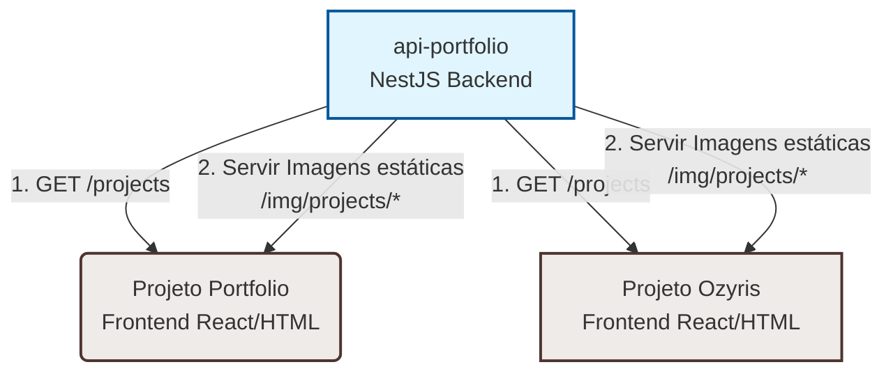

# Portfolio API

Uma API REST desenvolvida em **NestJS** e **TypeScript** criada com o objetivo de centralizar as informações de projetos desenvolvidos. 

Esta API serve como uma **fonte única de verdade** (Single Source of Truth) para alimentar dinamicamente a seção de projetos de múltiplos frontends do mesmo ecossistema, como o site **Portfolio** e o site **Ozyris**.

---

## Sumário
- [Por que esta API existe?](#por-que-esta-api-existe)
- [Arquitetura da Solução](#arquitetura-da-solucao)
- [Tecnologias Utilizadas](#tecnologias-utilizadas)
- [Endpoints](#endpoints)
- [Documentação Interativa (Swagger)](#documentacao-interativa-swagger)
- [Estrutura do Modelo de Projeto](#estrutura-do-modelo-de-projeto)
- [Estrutura do Modelo de Tecnologia](#estrutura-do-modelo-de-tecnologia)
- [Como Executar o Projeto](#como-executar-o-projeto)
- [Exemplo de Integração no Frontend](#exemplo-de-integracao-no-frontend)

---

## Por que esta API existe?

Anteriormente, tanto o projeto **Portfolio** quanto o projeto **Ozyris** mantinham arquivos JSON estáticos locais com a lista de projetos desenvolvidos. Essa abordagem trazia alguns problemas:
1. **Redundância:** Toda vez que um novo site era criado, era necessário atualizar manualmente o arquivo JSON em ambos os projetos.
2. **Duplicação de Assets:** As imagens/previews dos projetos precisavam estar salvas nas pastas públicas de cada site.
3. **Inconsistência de Dados:** Risco de esquecer de atualizar um dos repositórios, gerando discrepâncias entre o portfólio pessoal e o site institucional.

**Com a API Centralizada:**
- **Sincronização Automática:** Qualquer alteração no backend é refletida instantaneamente em todos os sites conectados.
- **Centralização de Mídia:** As imagens dos projetos ficam armazenadas no servidor da própria API (pasta `public/`), eliminando a necessidade de duplicar arquivos.
- **Facilidade de Escala:** Se um terceiro site precisar exibir a lista de projetos no futuro, basta consumir a mesma API.

---

## Arquitetura da Solução

O diagrama abaixo ilustra como a API interage com os frontends:



---

## Tecnologias Utilizadas

- **[NestJS](https://nestjs.com/)** - Framework progressivo de Node.js para construção de APIs eficientes e escaláveis.
- **[TypeScript](https://www.typescriptlang.org/)** - Tipagem estática para maior segurança e produtividade.
- **Serve Static Module** - Para servir as imagens dos projetos (`/public/img/projects/`) diretamente via rotas estáticas do servidor.

---

## Endpoints

### 1. Rota Raiz (Metadados)
Retorna os metadados da aplicação, versão e as rotas disponíveis.
* **URL:** `/`
* **Método:** `GET`
* **Resposta Exemplo:**
```json
{
  "name": "Portfolio API",
  "version": "1.0.0",
  "author": "Luis Henrique",
  "description": "API responsável por centralizar e disponibilizar os projetos e tecnologias/cursos utilizados nos sites Portfolio e Ozyris.",
  "routes": {
    "projects": "/projects",
    "technologies": "/technologies"
  }
}
```

### 2. Projetos
Retorna a lista completa dos projetos cadastrados.
* **URL:** `/projects`
* **Método:** `GET`
* **Resposta Exemplo:**
```json
[
  {
    "name": "Imports Manos",
    "title": "Criação do site para loja virtual",
    "image": "/img/projects/imports-manos.png",
    "category": "Ozyris",
    "date": "04/2026",
    "href": "https://importsmanos.com.br/"
  },
  {
    "name": "Banco do Brasil Asset",
    "title": "Criação do site para fundos",
    "image": "/img/projects/bbasset.png",
    "category": "MZ Group",
    "date": "01/2026",
    "href": "https://www.bbasset.com.br/"
  }
]
```

### 3. Tecnologias / Cursos (Skills)
Retorna a lista completa de competências técnicas, incluindo status de conclusão do aprendizado, certificados e repositórios de estudo.
* **URL:** `/technologies`
* **Método:** `GET`
* **Resposta Exemplo:**
```json
[
  {
    "name": "JavaScript",
    "category": "Front-end",
    "icon": "FaJsSquare",
    "completed": true,
    "hide": false,
    "completion_date": "2023-06-18",
    "certificates": [
      {
        "name": "Certificado de Conclusão",
        "link": "https://www.udemy.com/certificate/UC-d479fda3-61af-43f4-96b4-ba3de4357647/"
      }
    ],
    "repositories": [
      {
        "name": "Curso 2023",
        "link": "https://github.com/luisitcho/curso-javascript-otavio-2023",
        "current": true,
        "past": true
      }
    ]
  }
]
```

---

## Documentação Interativa (Swagger)

A API possui uma interface interativa de documentação desenvolvida com o **Swagger (OpenAPI)**. Nela, você pode visualizar todos os endpoints em tempo real e realizar testes de requisições diretamente do navegador.

* **URL de Acesso local:** `http://localhost:3000/api`

Para visualizar a documentação:
1. Certifique-se de iniciar a aplicação (modo desenvolvimento ou produção).
2. Abra seu navegador de preferência e navegue até `http://localhost:3000/api`.

---

## Estrutura do Modelo de Projeto

Cada projeto retornado no array possui a seguinte estrutura:

| Atributo | Tipo | Descrição | Exemplo |
| :--- | :--- | :--- | :--- |
| `name` | `string` | Nome do cliente ou empresa do projeto | `"Imports Manos"` |
| `title` | `string` | Breve descrição da entrega ou escopo do trabalho | `"Criação do site para loja virtual"` |
| `image` | `string` | URL relativa da imagem do projeto servida pela API | `"/img/projects/imports-manos.png"` |
| `category` | `string` | Categoria ou marca sob a qual o projeto foi executado | `"Ozyris"` |
| `date` | `string` | Mês e ano de conclusão | `"04/2026"` |
| `href` | `string` | Link direto para o projeto no ar ou repositório | `"https://importsmanos.com.br/"` |

> [!NOTE]
> O caminho das imagens é **relativo**. No frontend consumidor, concatene a URL base da API com o valor retornado em `image` para renderizar a imagem corretamente. Exemplo: `https://sua-api.com/img/projects/imports-manos.png`.

---

## Estrutura do Modelo de Tecnologia

Cada item retornado na rota `/technologies` possui a seguinte estrutura:

| Atributo | Tipo | Descrição | Exemplo |
| :--- | :--- | :--- | :--- |
| `name` | `string` | Nome da tecnologia/competência | `"JavaScript"` |
| `category` | `string` | Categoria de atuação (ex: `"Front-end"`, `"Back-end"`, `"DevOps"`, `"Ferramentas"`) | `"Front-end"` |
| `icon` | `string` | Nome do ícone associado no pacote `react-icons` | `"FaJsSquare"` |
| `completed` | `boolean` | Indica se o curso ou estudo principal foi concluído | `true` |
| `hide` | `boolean` | Define se a tecnologia deve ser oculta no frontend | `false` |
| `completion_date` | `string` (opcional) | Data de conclusão do estudo principal (AAAA-MM-DD) | `"2023-06-18"` |
| `certificates` | `array` (opcional) | Lista de certificados contendo `name` e `link` | Ver exemplo acima |
| `repositories` | `array` (opcional) | Lista de repositórios de estudo contendo `name`, `link`, `current` e `past` | Ver exemplo acima |

> [!NOTE]
> Os ícones são retornados como `string` (ex: `"FaJsSquare"`). No frontend React, você pode mapear essas strings para os componentes de ícones reais importados de `react-icons`.

---

## Como Executar o Projeto

### Pré-requisitos
* Node.js instalado (versão v18 ou superior recomendada)
* Gerenciador de pacotes npm

### Instalação
Clone o repositório e instale as dependências:
```bash
npm install
```

### Inicialização
```bash
# Modo de desenvolvimento (recarregamento automático)
npm run start:dev

# Modo de produção
npm run start:prod
```

### Executar Testes
```bash
# Testes unitários
npm run test

# Testes de integração (E2E)
npm run test:e2e
```

---

## Exemplo de Integração no Frontend

Veja abaixo um exemplo simples em JavaScript/TypeScript de como carregar os projetos no frontend e filtrar por categoria (ex: exibir apenas projetos com a categoria `Ozyris`):

```typescript
const API_URL = 'http://localhost:3000'; // Substitua pela URL da sua API

interface Project {
  name: string;
  title: string;
  image: string;
  category: string;
  date: string;
  href: string;
}

async function loadProjects() {
  try {
    const response = await fetch(`${API_URL}/projects`);
    const projects: Project[] = await response.json();

    // 1. Filtrar projetos que pertencem especificamente à categoria "Ozyris"
    const ozyrisProjects = projects.filter(p => p.category === 'Ozyris');
    
    // 2. Renderizar ou utilizar os dados
    ozyrisProjects.forEach(project => {
      const fullImageUrl = `${API_URL}${project.image}`;
      console.log(`Projeto: ${project.name} | Preview: ${fullImageUrl}`);
    });
  } catch (error) {
    console.error('Erro ao buscar projetos:', error);
  }
}
```
